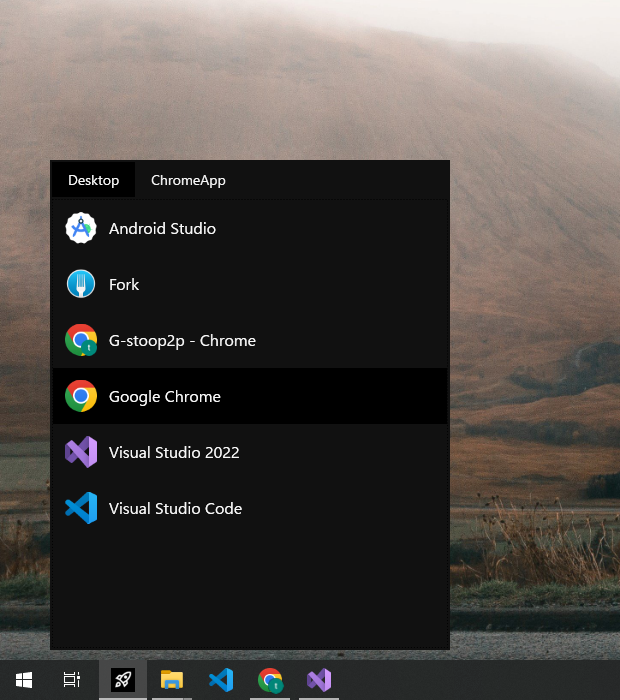
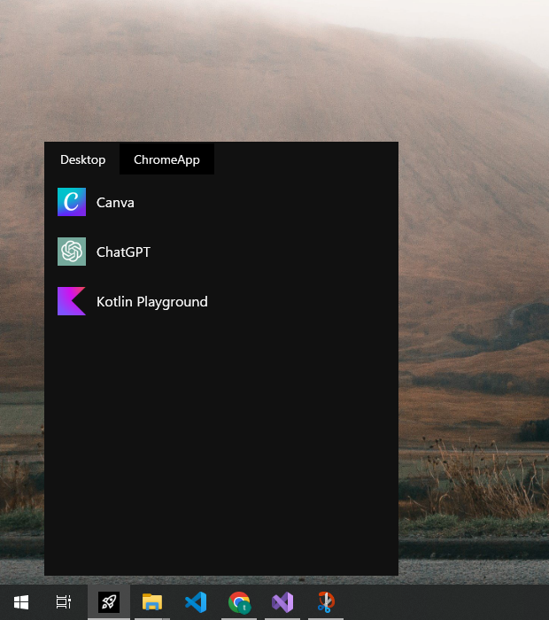

# DesktopShortcutLauncher

Author: [stooptoop](https://github.com/stooptoop)  
Email: stoop2p@gmail.com

## Table of Contents

- [Introduction](#Introduction)
- [Installation](#Installation)
- [Usage](#Usage)
- [Configuration](#Configuration)
- [Recommended Usage](#Recommended%20Usage)
- [Dependencies](#Dependencies)
- [License](#license)

## Introduction

`DesktopShortcutLauncher` is a launcher application for Windows.  
this application serves as a convenient launcher for your desktop shortcuts.  
you can instantly access and manage your various shortcut files (*.lnk, *.url) within a directory.




## Installation

To install `DesktopShortcutLauncher`, follow these simple steps:

- Download the latest Application from [here](https://github.com/stooptoop/DesktopShortcutLauncher/releases).
- Unzip the downloaded file and place the `DesktopShortcutLauncher` directory in the desired location. It contains the exe file `DesktopShortcutLauncher.exe`. 
- Run the `DesktopShortcutLauncher.exe` 

When first launched `DesktopShortcutLauncher.exe`, it will list the shortcut files in your `Desktop` directory.  
By editing the `launcherConfig.json`, you can target directories other than the desktop.

No further installations or setups are required. Enjoy the convenience of managing and accessing your desktop shortcuts effortlessly with Desktop Shortcut Launcher!

Please see [Configuration](#Configuration).

## Usage

It is easy to use.

After run `DesktopShortcutLauncher.exe`, a small window will appear in the lower left corner of the screen, displaying a list of shortcuts. You can launch a shortcut by clicking on one of them.  
After launching a shortcut, the window will disappear from the screen. To make it appear again, click on the icon on the taskbar.


## Configuration

`DesktopShortcutLauncher` can be configured with several options through configuration file.
By editing `launcherConfig.json`, you can customize the target directories, display locations, etc. 

`launcherConfig.json` is located in the same place as `DesktopShortcutLauncher.exe`.

### launcherConfig.json

Example:
```json
{
    "DirectoryPaths": [
        "C:\\Users\\Stooptoop\\Desktop",
        "C:\\Users\\Stooptoop\\Shortcuts"
    ],
    "Layout": {
        "X": 50,
        "Width": 400,
        "HeightRatio": 0.5
    }
}
```

**Available Configuration Options:**

These options are optional. If omitted, using default values.

|Option|Type|Description|
|------|----|-----------|
|DirectoryPaths|[String]|Directory paths for listing shortcuts.<br>The shortcut listings are divided into tabs for each directory.<br>**Default**: Only `Desktop` directory is targeted.|
|Layout|Struct|Layout configurations of application window.|
|- X|Integer|X-coordinate position of application window.<br>**Default**: 50|
|- Width|Integer|Width of application window. <br>**Default**: 400|
|- HeightRatio|Double|Ratio of window height to screen. Value range is 0 to 1.0 .<br>**Default**: 0.5|

When the configuration is complete, please restart `DesktopShortcutLauncher.exe` to reflect it.

## Recommended Usage

Here are some tips for optimizing your experience!

1. **Pin to Taskbar**: `DesktopShortcutLauncher` is assumed to be accessed frequently. Therefore, it is recommended to Pin `DesktopShortcutLauncher` to your taskbar for quick and easy access. Simply right-click on the application icon and select "Pin to Taskbar" in Windows.
2. **Grouping Shortcuts**: It is recommended to group the directories separately by shortcut categories. example,
    - **Frequent Applications**
    - **Google Chrome Shortcuts (PWA)**
    - **Frequently Accessed Directories**

    etc

## Dependencies

- [Microsoft WindowsAPICodePack Shell](https://www.nuget.org/packages/Microsoft-WindowsAPICodePack-Shell/)
- [Json.NET](https://www.newtonsoft.com/json)
- [System.Drawing.Common](https://www.nuget.org/packages/System.Drawing.Common/)

## License

No specific license is applied to `DesktopShortcutLauncher`.
This software is provided as-is without any warranty or guarantee of liability.Users are encouraged to utilize, modify, and distribute the software responsibly and at their own risk.


Thank you for reading and your support, it's truly appreciated!
